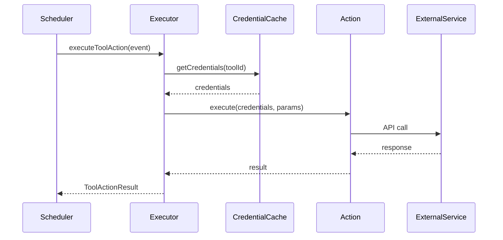

# Tool Actions API Reference

## Overview

The Tool Actions API allows programmatic interaction with Cronium's tool integration system. This document covers the tRPC endpoints, data structures, and execution flow.

## Table of Contents

1. [Authentication](#authentication)
2. [Core Endpoints](#core-endpoints)
3. [Data Structures](#data-structures)
4. [Execution Flow](#execution-flow)
5. [Creating Custom Actions](#creating-custom-actions)
6. [Error Handling](#error-handling)

## Authentication

All API calls require authentication via session or API token.

```typescript
// Using tRPC client
import { trpc } from "@/lib/trpc/client";

// Authenticated calls
const tools = await trpc.tools.getAll.query();
```

## Core Endpoints

### Tools Management

#### List Tools

```typescript
// Get all user tools
const { tools, total } = await trpc.tools.getAll.query({
  limit: 100,
  offset: 0,
  search: "slack",
  type: ToolType.SLACK,
  isActive: true,
});
```

#### Get Tool by ID

```typescript
const tool = await trpc.tools.getById.query({ id: 123 });
```

#### Create Tool

```typescript
const newTool = await trpc.tools.create.mutate({
  name: "Team Slack",
  type: ToolType.SLACK,
  credentials: {
    webhookUrl: "https://hooks.slack.com/...",
    channel: "#general",
  },
  description: "Main team communication",
  tags: ["team", "communication"],
  isActive: true,
});
```

#### Update Tool

```typescript
const updated = await trpc.tools.update.mutate({
  id: 123,
  name: "Updated Name",
  credentials: {
    /* new credentials */
  },
  isActive: false,
});
```

#### Delete Tool

```typescript
await trpc.tools.delete.mutate({ id: 123 });
```

#### Test Connection

```typescript
const result = await trpc.tools.testConnection.mutate({ id: 123 });
// Returns: { success: boolean, message: string, details: object }
```

### Tool Actions

#### Execute Action

```typescript
const result = await trpc.tools.executeAction.mutate({
  toolId: 123,
  actionId: "slack.send-message",
  parameters: {
    channel: "#general",
    message: "Hello from API!",
  },
  isTest: true, // Optional test mode
});
```

#### Get Tool Stats

```typescript
const stats = await trpc.tools.getStats.query({
  period: "day", // hour, day, week, month
  groupBy: "type", // type, status, action
  toolId: 123, // Optional specific tool
});
```

### Tool Action Logs

#### Get Recent Logs

```typescript
const { logs, total } = await trpc.toolActionLogs.getRecent.query({
  limit: 50,
  offset: 0,
  toolType: "slack",
  status: "SUCCESS", // or "FAILURE"
});
```

#### Get Logs by Event

```typescript
const logs = await trpc.toolActionLogs.getByEventId.query({
  eventId: 456,
});
```

## Data Structures

### Tool Interface

```typescript
interface Tool {
  id: number;
  userId: string;
  name: string;
  type: ToolType;
  credentials: ToolCredentials;
  description?: string;
  tags: string[];
  isActive: boolean;
  createdAt: Date;
  updatedAt: Date;
}
```

### Tool Types

```typescript
enum ToolType {
  SLACK = "SLACK",
  DISCORD = "DISCORD",
  EMAIL = "EMAIL",
  WEBHOOK = "WEBHOOK",
  HTTP = "HTTP",
  GOOGLE_SHEETS = "GOOGLE_SHEETS",
  NOTION = "NOTION",
  TEAMS = "TEAMS",
  TRELLO = "TRELLO",
}
```

### Tool Action Configuration

```typescript
interface ToolActionConfig {
  toolType: string;
  toolId: number;
  actionId: string;
  parameters: Record<string, any>;
  outputMapping?: Record<string, string>;
}
```

### Tool Action Result

```typescript
interface ToolActionResult {
  stdout: string;
  stderr: string;
  exitCode: number;
  data?: any;
  healthStatus?: {
    status: "healthy" | "degraded" | "failing";
    latency: number;
  };
}
```

### Action Definition

```typescript
interface ToolAction {
  id: string;
  name: string;
  description: string;
  actionType: "message" | "create" | "update" | "delete" | "query";
  inputSchema: ZodSchema;
  outputSchema?: ZodSchema;
  execute: (
    credentials: any,
    parameters: any,
    context: ExecutionContext,
  ) => Promise<any>;
}
```

## Execution Flow

### 1. Event Creation

```typescript
// Create event with tool action
const event = await trpc.events.create.mutate({
  name: "Daily Slack Update",
  type: EventType.TOOL_ACTION,
  toolActionConfig: JSON.stringify({
    toolType: "SLACK",
    toolId: 123,
    actionId: "slack.send-message",
    parameters: {
      channel: "#updates",
      message: "Daily update: {{DATE}}",
    },
  }),
  triggerType: EventTriggerType.SCHEDULE,
  schedule: "0 9 * * *", // 9 AM daily
});
```

### 2. Execution Process



### 3. Error Handling Flow

```typescript
try {
  const result = await executeToolAction(event);
  // Log success
  await logExecution({
    status: "SUCCESS",
    executionTime: result.executionTime,
  });
} catch (error) {
  // Categorize error
  const categorized = ErrorCategorizer.categorize(error, toolType);

  // Retry if appropriate
  if (categorized.retryable) {
    await retryWithBackoff(() => executeToolAction(event));
  }

  // Log failure
  await logExecution({
    status: "FAILURE",
    errorMessage: categorized.userMessage,
  });
}
```

## Creating Custom Actions

### 1. Define Action Schema

```typescript
import { z } from "zod";

const myActionSchema = z.object({
  id: z.string(),
  name: z.string(),
  description: z.string(),
  actionType: z.literal("create"),
  inputSchema: z.object({
    title: z.string(),
    content: z.string(),
    priority: z.enum(["low", "medium", "high"]),
  }),
});
```

### 2. Implement Execute Function

```typescript
async function executeMyAction(
  credentials: MyToolCredentials,
  parameters: MyActionInput,
  context: ExecutionContext,
): Promise<MyActionOutput> {
  // Log progress
  context.logger.info(`Creating item: ${parameters.title}`);
  context.onProgress?.({ step: "Connecting", percentage: 20 });

  // Make API call
  const client = new MyServiceClient(credentials);
  const result = await client.createItem({
    title: parameters.title,
    content: parameters.content,
    priority: parameters.priority,
  });

  context.onProgress?.({ step: "Completed", percentage: 100 });

  return {
    id: result.id,
    url: result.url,
    createdAt: result.createdAt,
  };
}
```

### 3. Register Action

```typescript
const myAction: ToolAction = {
  id: "mytool.create-item",
  name: "Create Item",
  description: "Creates a new item in MyTool",
  actionType: "create",
  inputSchema: myActionInputSchema,
  outputSchema: myActionOutputSchema,
  execute: executeMyAction,
};

// Register with plugin
myToolPlugin.actions = [myAction];
ToolPluginRegistry.register(myToolPlugin);
```

## Error Handling

### Error Categories

```typescript
type ErrorCategory =
  | "network" // Connection issues
  | "authentication" // Invalid credentials
  | "authorization" // Permission denied
  | "rate_limit" // Too many requests
  | "validation" // Invalid parameters
  | "timeout" // Request timeout
  | "server_error" // 5xx errors
  | "unknown"; // Uncategorized
```

### Retry Configuration

```typescript
const retryConfig = {
  maxAttempts: 3,
  initialDelay: 1000,
  maxDelay: 10000,
  backoffMultiplier: 2,
  jitter: true,
  retryableErrors: ["timeout", "network", "rate_limit"],
  nonRetryableErrors: ["authentication", "validation"],
};
```

### Circuit Breaker

```typescript
const circuitBreakerConfig = {
  failureThreshold: 5,
  successThreshold: 2,
  timeout: 60000, // 1 minute
  errorThresholdPercentage: 50,
};
```

## Rate Limiting

### Default Limits

```typescript
const rateLimits = {
  slack: { requests: 60, window: "1m" },
  discord: { requests: 60, window: "1m" },
  email: { requests: 30, window: "1m" },
  googleSheets: { requests: 100, window: "1m" },
};
```

### User Quotas

```typescript
const quotas = {
  free: { daily: 1000, hourly: 100 },
  pro: { daily: 10000, hourly: 1000 },
  enterprise: { daily: 100000, hourly: 10000 },
};
```

## Security

### Credential Encryption

- All credentials encrypted at rest using AES-256-GCM
- Master key rotation supported
- Audit logging for all credential access

### API Security

- Session-based authentication required
- Rate limiting per user/tool
- Input validation on all parameters
- Output sanitization

## Examples

### Send Slack Message with Retry

```typescript
const sendSlackMessage = async (channel: string, message: string) => {
  const tools = await trpc.tools.getAll.query({
    type: ToolType.SLACK,
    isActive: true,
  });

  if (tools.total === 0) {
    throw new Error("No active Slack tool configured");
  }

  const tool = tools.tools[0];

  const retryExecutor = createRetryExecutor("exponential", {
    maxAttempts: 3,
    initialDelay: 1000,
  });

  return retryExecutor.execute(async () => {
    return trpc.tools.executeAction.mutate({
      toolId: tool.id,
      actionId: "slack.send-message",
      parameters: { channel, message },
    });
  });
};
```

### Batch Email Notifications

```typescript
const sendBatchEmails = async (recipients: string[], subject: string) => {
  const emailTool = await trpc.tools.getAll.query({
    type: ToolType.EMAIL,
    isActive: true,
  });

  const results = await Promise.allSettled(
    recipients.map((to) =>
      trpc.tools.executeAction.mutate({
        toolId: emailTool.tools[0].id,
        actionId: "email.send",
        parameters: {
          to,
          subject,
          body: "Notification content...",
        },
      }),
    ),
  );

  return {
    sent: results.filter((r) => r.status === "fulfilled").length,
    failed: results.filter((r) => r.status === "rejected").length,
  };
};
```

## Best Practices

1. **Always validate input** using Zod schemas
2. **Handle errors gracefully** with proper categorization
3. **Implement retries** for transient failures
4. **Use circuit breakers** to prevent cascade failures
5. **Monitor execution metrics** via the dashboard
6. **Cache credentials** to reduce database queries
7. **Log important events** for debugging
8. **Test in isolation** before production use

---

For more information, see:

- [User Guide](../TOOL_ACTIONS_GUIDE.md)
- [Quick Reference](../TOOL_ACTIONS_QUICK_REFERENCE.md)
- [Contributing Guide](../CONTRIBUTING.md)
