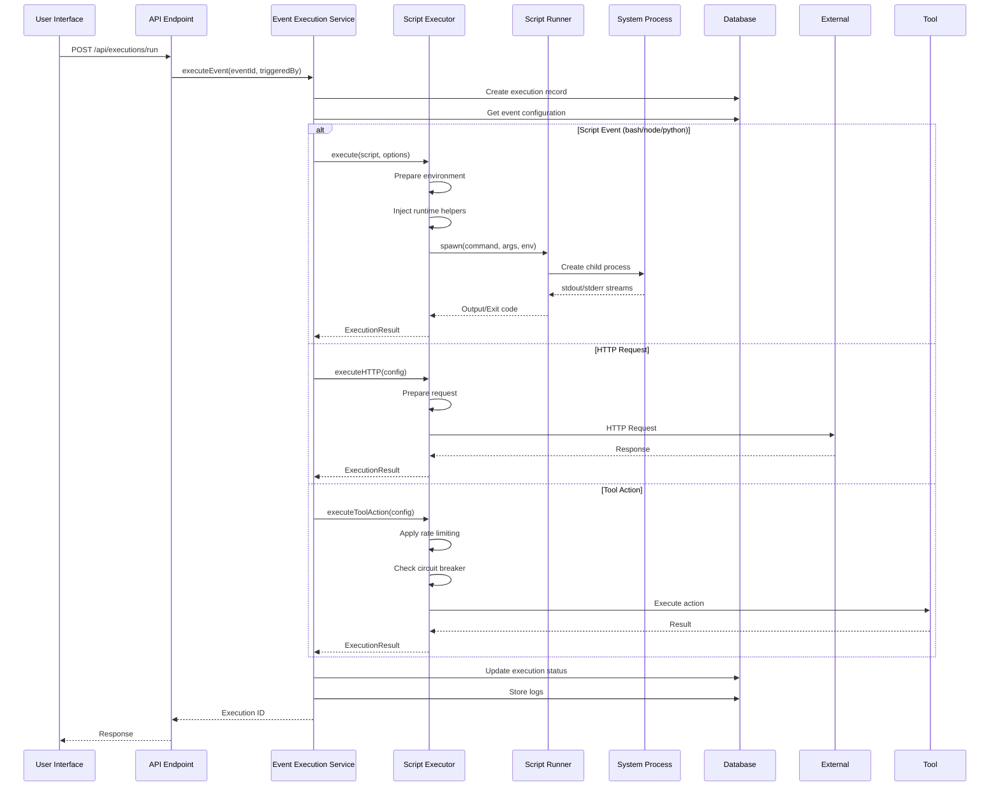
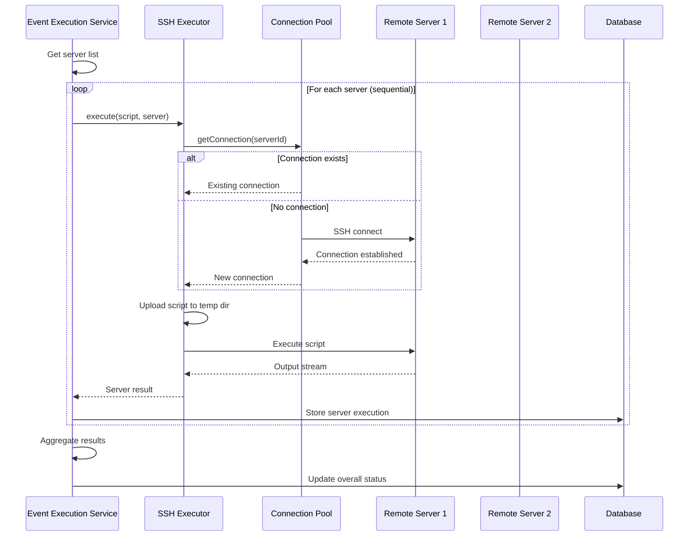
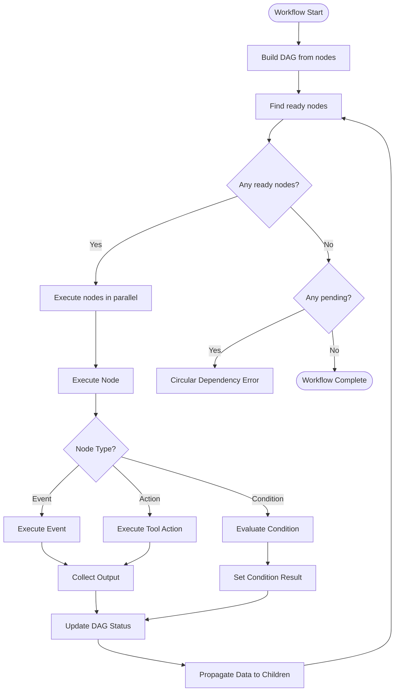
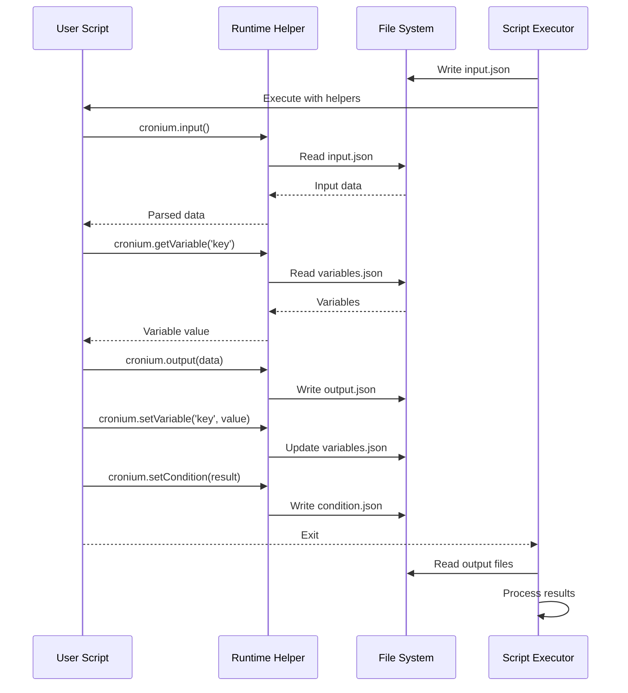
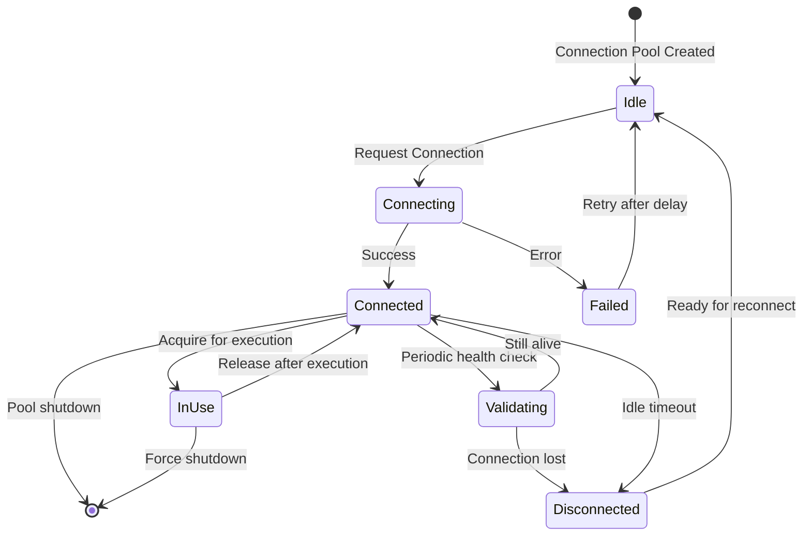
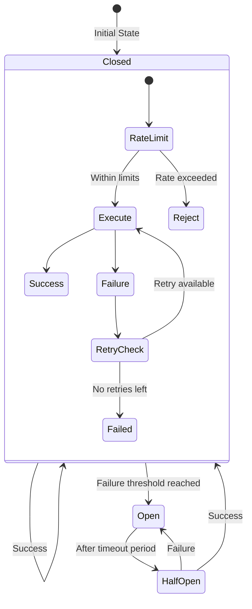
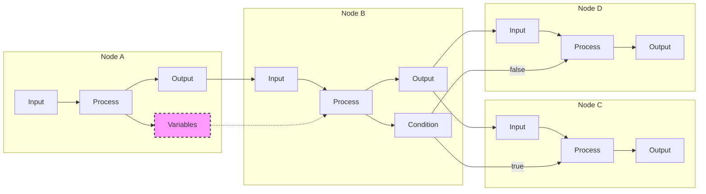
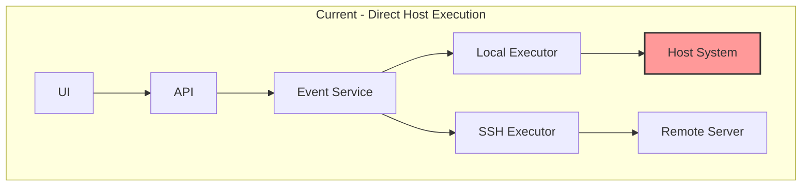
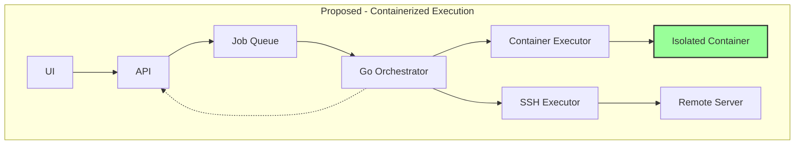

# Phase 1: Execution Flow Diagrams

## Overview

This document contains detailed flow diagrams illustrating how Cronium currently executes events, manages workflows, and handles various execution scenarios. These diagrams are essential for understanding the current system before implementing the containerized architecture.

## 1. Single Event Execution Flow

## 2. Multi-Server Execution Flow

## 3. Workflow Execution Flow

## 4. Runtime Helper Integration Flow

## 5. SSH Connection Management Flow

## 6. Tool Action Execution with Circuit Breaker

## 7. Data Flow Through Workflow Nodes

## 8. Current vs. Proposed Architecture

### Current Architecture

### Proposed Architecture

## Key Observations

### 1. Sequential Bottlenecks

- Multi-server executions happen sequentially, not in parallel
- No job queuing mechanism for better resource utilization
- Synchronous execution blocks API responses

### 2. Security Concerns

- Direct process spawning without isolation
- Shared file system access across executions
- No resource constraints or limits
- Scripts can access application secrets

### 3. Missing Features

- No real-time log streaming during execution
- Limited retry mechanisms
- Basic error handling
- No execution prioritization

### 4. Data Management

- Heavy reliance on temporary files
- No cleanup mechanism for orphaned files
- Variables stored in plain JSON files
- No data encryption or access control

### 5. Monitoring Gaps

- No execution metrics collection
- Limited visibility into resource usage
- No performance profiling
- Basic logging without structure

## Migration Impact Analysis

### Components Requiring Major Changes

1. **Event Execution Service**: Add job queuing logic
2. **Script Executors**: Replace with job submission
3. **Log Management**: Implement real-time streaming
4. **API Endpoints**: Add internal orchestrator APIs

### Components Requiring Minor Changes

1. **Runtime Helpers**: Ensure container compatibility
2. **SSH Executor**: Port to Go with improvements
3. **Database Schema**: Add job queue tables
4. **WebSocket Handler**: Extend for log streaming

### New Components Required

1. **Go Orchestrator**: Core execution engine
2. **Job Queue**: Persistent job storage
3. **Container Manager**: Docker integration
4. **Log Streamer**: Real-time log delivery

## Summary

These diagrams illustrate the complexity of the current execution system and highlight areas where the containerized architecture will provide significant improvements:

1. **Security**: Isolation through containers
2. **Performance**: Parallel execution capabilities
3. **Reliability**: Better error handling and recovery
4. **Observability**: Real-time monitoring and logging
5. **Scalability**: Distributed execution ready

The migration must carefully preserve the existing data flow patterns while introducing these improvements to ensure backward compatibility and a smooth transition.
